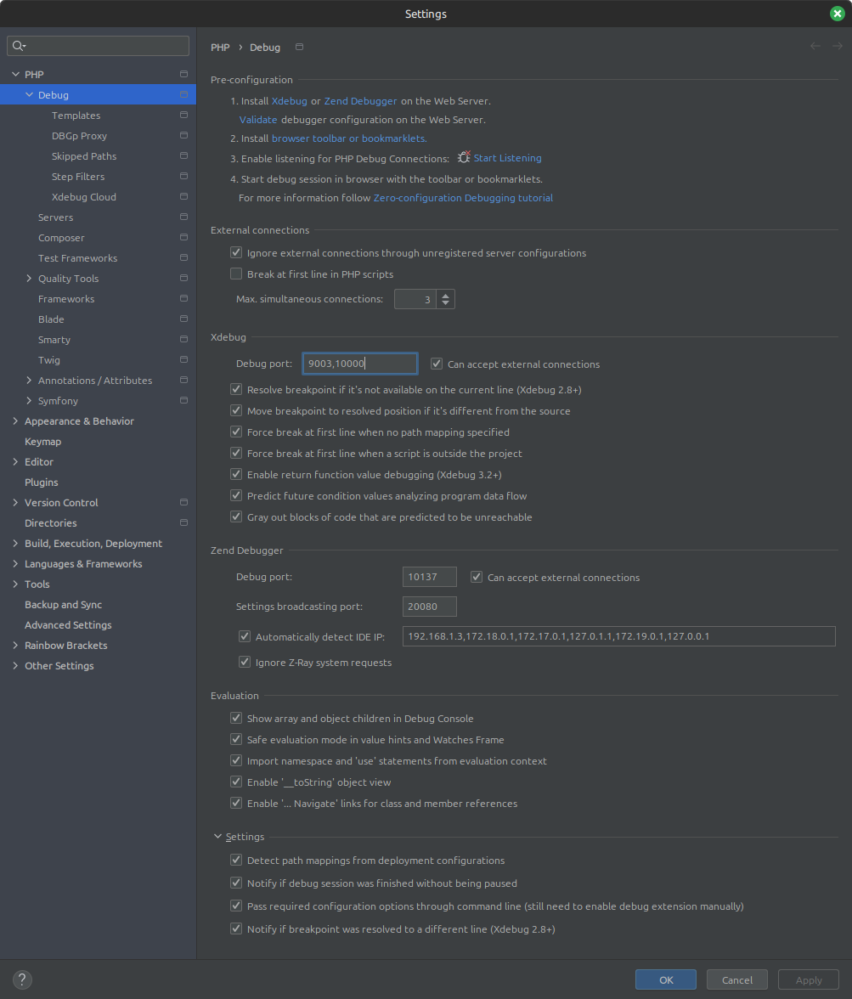
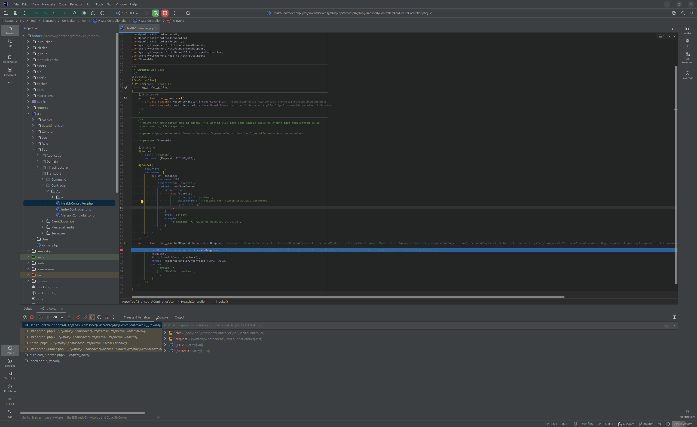

# Xdebug
This document describing how you can use [Xdebug](https://xdebug.org/) and [PhpStorm](https://www.jetbrains.com/phpstorm/) for the DEV environment.

## Configuration and usage
Please follow [PhpStorm](phpstorm.md) documentation before actions described below.

### PhpStorm basic configuration
1.Check /docker/dev/xdebug-main.ini or /docker/dev/xdebug-osx.ini (optional)

- Set option in case you need to debug every request to an api (by default):
```bash
xdebug.start_with_request = yes
```

- Set option in case you need to debug only requests with IDE KEY: PHPSTORM from frontend in your browser:
```bash
xdebug.start_with_request = no
```

2.Go to `Settings -> Php -> Debug` and set Xdebug port `10000`

3.Check your `Run/Debug Configurations` as on image below:




4.Install browser extensions (optional, see step 1). For example, for Firefox, install extension "Xdebug helper" and set in extension settings IDE KEY: PHPSTORM

### Using Xdebug
After actions above, you can start listening for incoming PHP debug connections:

1. Add breakpoint to your code
2. Enable Xdebug in your browser (optional, required only when xdebug.start_with_request = no)
3. Click `Debug` button in PhpStorm
4. Reload page in the browser

If everything configured properly, you will get something like next:



## Debug Postman requests
If you're using [Postman](https://www.getpostman.com/) to test/debug your application, when `xdebug.start_with_request = no`, you need to add `?XDEBUG_SESSION_START=PHPSTORM` to each URL that you use with Postman.
If you have default configuration (`xdebug.start_with_request = yes`) - nothing to do and your Xdebug should work out of the box.

## Debug Console commands / Messenger async handlers
If you want to debug console commands or messenger async handlers, you need to uncomment/edit (nothing to do in case MacOS and `XDEBUG_CONFIG=osx`) option `xdebug.client_host` inside config `docker/dev/xdebug-main.ini`:
```bash
xdebug.client_host=172.17.0.1
```
Just find out the proper host ip in your docker bridge configuration and set above option (in general it is `172.17.0.1`).
Don't forget to rebuild docker containers according to [general](../readme.md) documentation.

If you want to debug your messenger async jobs, please follow the next steps:

1. Enter inside `supervisord` docker container shell using your local shell command `make ssh-supervisord`
2. Inside `supervisord` container shell run the next command `supervisorctl`
3. Stop program `messenger-consume:messenger-consume_00` using the next command `stop messenger-consume:messenger-consume_00` and make sure that you can see message `messenger-consume:messenger-consume_00: stopped`
4. Exit from supervisorctl shell using the next command `exit`
5. Exit from `supervisord` docker container using command `exit`. Make sure that you are in the local shell.
6. Enter inside `symfony` docker container shell using your local shell command `make ssh`
7. Put necessary message in queue or make sure that it is already there
8. Run PHPStorm debug
9. Run inside `symfony` docker container shell the next command to run your async handlers `/usr/local/bin/php bin/console messenger:consume async_priority_high async_priority_low --limit=1` (where limit option is a number of messages that you want to debug)
10. Have fun with debugging and don't forget to turn on the program `messenger-consume:messenger-consume_00` (step 1, 2 and execute `start messenger-consume:messenger-consume_00`) inside `supervisord` docker container when you'll finish your debugging (or you can simply restart environment using your local shell command `make restart`).

## External documentations
* [Debugging PHP (web and cli) with Xdebug using Docker and PHPStorm](https://thecodingmachine.io/configuring-xdebug-phpstorm-docker)
* [Debug your PHP in Docker with Intellij/PHPStorm and Xdebug](https://gist.github.com/jehaby/61a89b15571b4bceee2417106e80240d)
* [Debugging with Postman and PHPStorm (Xdebug)](https://www.thinkbean.com/drupal-development-blog/debugging-postman-and-phpstorm-xdebug)
